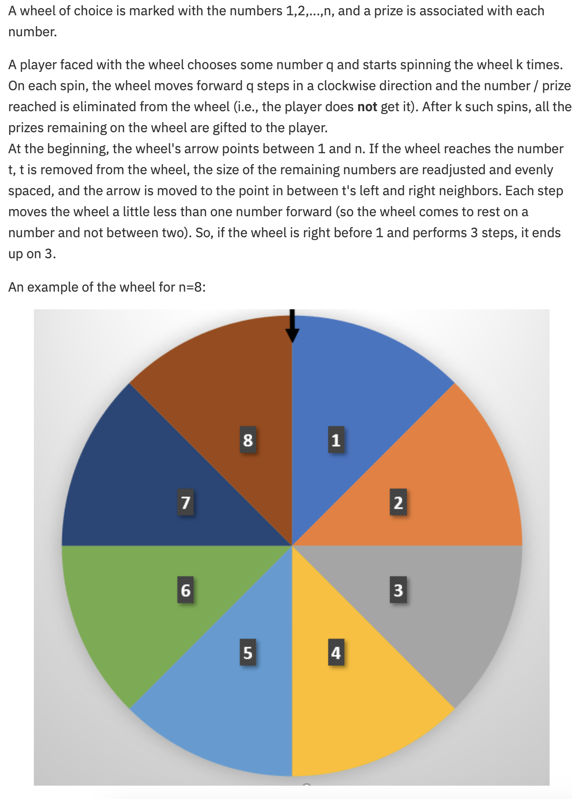
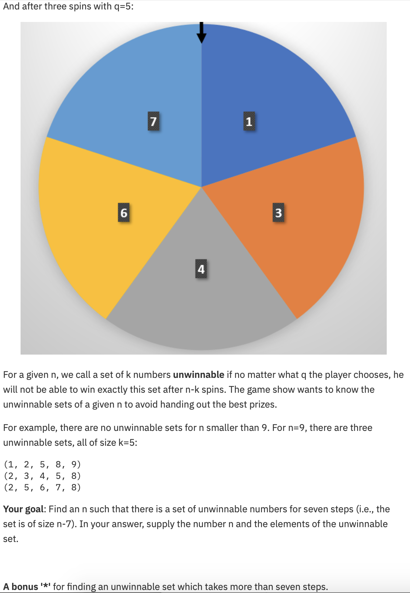

# April 2021 - Challenge

Original problem statement: https://www.research.ibm.com/haifa/ponderthis/challenges/April2021.html

# Problem statement

# Solution approach:

The problem and also the bonus question can be solved with the same approach.

I use the file "find_candidates.py" to simulate the spinning of the wheel. This allowed me to verify the example, but it also allows me to try out other $n$ and other $q$. For each $n$, I keep track of the "won" sets. I also generated all possible sets that could potentially be won, so after iterating through all $q$, I check whether any of the potential sets was never won. For smaller $n$ and seven steps, this experiment always ends up "winning" all possible sets.

I chose a relatively high limit for q. As I increased $n$, I found that for $n = 20$, there doesn't seem to be a $q$ that leaves no unwinnable sets. Even if I increase $q$ drastically, I am always left with the same set of numbers, which I assume to be unwinnable.

At this point, I have only a suspicion, but I don't have a proof that these sets are indeed unwinnable.

I use a second script (check_unwinnable.py) to verify that the set is indeed unwinnable. The way it works is that it iterates through all permutations of numbers that would need to be removed, if I want to win this set. Simple example:

If my numbers were [1,2,3,4,5] and I would expect the set (4,5) to be unwinnable, then I would need to check all iterations of [1,2,3]:

(1,2,3)
(1,3,2)
(2,1,3)
(2,3,1)
(3,1,2)
(3,2,1)

Any of these permutations could represent the order in which the numbers are eliminated by spinning the wheel.

The process of spinning the wheel can be modeled as a MIP.

It also turns out, that the process of spinning the wheel can be modeled as arithmetic sequences.

If it turns out that one of these permutations is equal to the sequence of how numbers can be eliminated with a given q, I have a prove that the set is not unwinnable.

The problem boils down to checking whether the arithmetic sequences that represents each of these permutations overlap. This can be checked with simple math using the Euclydian algorithm. More reading material on this can be found here:  [Wikipedia](https://en.wikipedia.org/wiki/Extended_Euclidean_algorithm) and [Stackexchange](https://math.stackexchange.com/questions/1656120/formula-to-find-the-first-intersection-of-two-arithmetic-progressions)

If all arithmetic sequences overlap, we solve a MIP instead to deduct the $q$ for which the set can be won.

# Solution:

I was able to prove that the following two sets of numbers are unwinnable for seven steps with $n = 20$:

(1, 2, 3, 4, 5, 6, 7, 8, 11, 14, 15, 16, 17)
(4, 5, 6, 7, 10, 13, 14, 15, 16, 17, 18, 19, 20)

For eight steps (bonus question) and $n = 28$, there are multiple solutions, but one of them is as follows:

(1, 2, 3, 4, 5, 6, 7, 8, 9, 10, 11, 12, 21, 22, 23, 24, 25, 26, 27, 28)

For nine steps or more, this method becomes a bit cumbersome. The "unwinnable check" is still working efficiently even for larger number of steps. I would be relatively confident that it would still work for 12 or 13 steps. However, the first step (finding possible candidates for unwinnable sets) will take a significant amount of time because very large $q$ would need too be tested.